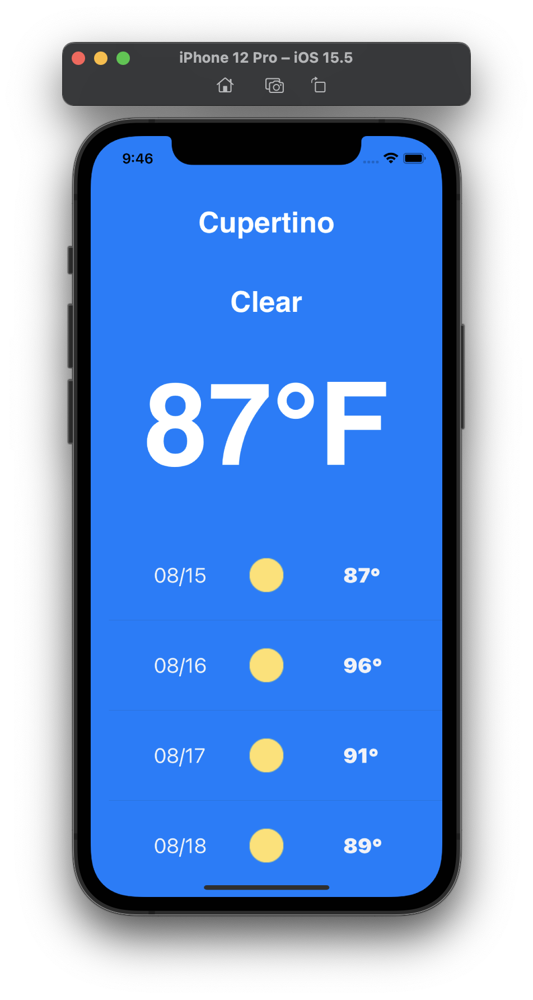

# SwiftWeather

### About:
- This project is a simple iOS weather app template.
- It shows the city, high temperatures, and the state of the weather for around 2 weeks.
- Weather information is from the [Tomorrow.io](https://www.tomorrow.io/weather-api/) API.
- The example below uses Apple's location, Cupertino.

### Building and Running:
1. Open the project in Xcode and hit Cmd + R to build and run. I didn't push some files from the original project, such as the app icons and the `.plist` files, so copy/pasting the code and making the necessary directories will probably be better than cloning.

